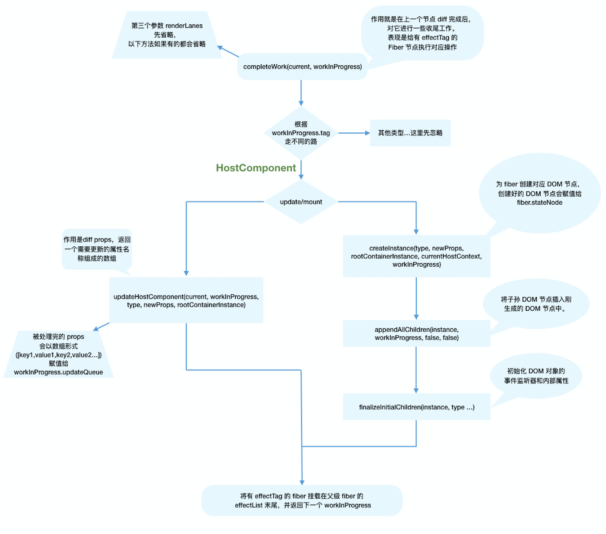

# completeWork

## 流程概述

- 类似 beginWork completeWork 也是针对不同 fiber.tag 调用不同的处理逻辑

```
function completeWork(
  current: Fiber | null,
  workInProgress: Fiber,
  renderLanes: Lanes,
): Fiber | null {
  const newProps = workInProgress.pendingProps;

  switch (workInProgress.tag) {
    case IndeterminateComponent:
    case LazyComponent:
    case SimpleMemoComponent:
    case FunctionComponent:
    case ForwardRef:
    case Fragment:
    case Mode:
    case Profiler:
    case ContextConsumer:
    case MemoComponent:
      return null;
    case ClassComponent: {
      // ...省略
      return null;
    }
    case HostRoot: {
      // ...省略
      updateHostContainer(workInProgress);
      return null;
    }
    case HostComponent: {
      // ...省略
      return null;
    }
  // ...省略
```

- 我们重点关注页面渲染所必须的 HostComponent(即原生的 DOM 组件对应的 Fiber 节点)

## 处理 HostComponent

- 和 beginWork 一样，会根据 current === null 来判断当前是 mount 还是 update

- 同时针对 HostComponent 判断 update 时我们还需要考虑 workInProgress.stateNode != null(即该节点是否存在对应的 DOM 节点)

```
case HostComponent: {
  popHostContext(workInProgress);
  const rootContainerInstance = getRootHostContainer();
  const type = workInProgress.type;

  if (current !== null && workInProgress.stateNode != null) {
    // update的情况
    // ...省略
  } else {
    // mount的情况
    // ...省略
  }
  return null;
}
```

## update 时

- 当 update 时 Fiber 节点已经存在对应的 DOM 节点，所以不需要生成 DOM 节点，需要做的主要是处理 props

  - onClick,onChange 等回调函数的注册
  - 处理 style props
  - 处理 DANGEROUSLY_SET_INNER_HTML prop
  - 处理 children prop

- 去掉一些当前不需要关注的功能（比如 ref） 可以看到最主要的逻辑是调用 updateHostComponent 方法

```
if(current !== null && workInProgress != null){
    updateHostComponent(current,
    workInProgress,
    type,
    newProps,
    rootContainerInstance
    )
}
```

* 你可以从这里看到updateHostComponent方法定义
    
* 在updateHostComponent内部，被处理完的props会被赋值给workInProgress.updateQueue，并最终会在commit阶段被渲染在页面上
    - ``` workInProgress.updateQueue = (updatePayload:any) ```

* 其中updatePayload为数组形式，他的奇数索引的值为变化的prop key，偶数的索引为变化的prop value

## mount时

* 同样 我们省略了不想关的逻辑。可以看到，mount时的主要逻辑包括三个
    - 为Fiber节点生成对应DOM节点
    - 将子孙DOM节点插入刚生成的DOM节点中
    - 与update逻辑中的updateHostComponent类似的处理props的过程

```
// mount的情况

// ...省略服务端渲染相关逻辑

const currentHostContext = getHostContext();
// 为fiber创建对应DOM节点
const instance = createInstance(
    type,
    newProps,
    rootContainerInstance,
    currentHostContext,
    workInProgress,
  );
// 将子孙DOM节点插入刚生成的DOM节点中
appendAllChildren(instance, workInProgress, false, false);
// DOM节点赋值给fiber.stateNode
workInProgress.stateNode = instance;

// 与update逻辑中的updateHostComponent类似的处理props的过程
if (
  finalizeInitialChildren(
    instance,
    type,
    newProps,
    rootContainerInstance,
    currentHostContext,
  )
) {
  markUpdate(workInProgress);
}
```

* 还记得：mount时只会子啊rootFiber存在placement effectTag 那么commit阶段是如何通过一次插入DOM操作将整颗DOM树插入页面呢？

* 原因就在与completeWork中的appendAllChildren方法
    - 由于completeWork属于归阶段调用的函数，每次调用appendAllChildren时都会将已经生成的子孙DOM节点插入到当前生成的DOM节点下，那么当归到rootFiber时，我们已经有一个构建好的离屏DOM树


## effectlist

* 至此render阶段的绝大部分工作已经完成

* 还有一个问题： 作为DOM操作的依据，commit阶段需要找到所有有effectTag的Fiber节点并依次执行effectTag的对应操作，难道需要在commit阶段在遍历一次Fiber树需要 effectTag !== null 的节点吗

* 为了解决这个问题，在completetWork的上层函数 completeUnitOfWork 中，每个执行完completeWork且存在effectTag的Fiber节点会被保存在一条被称为effectlist的单向链表中

* effectlist 中第一个Fiber节点保存在fiber.firstEffect 最后一个元素保存在fiber.lastEffect

* 类似appendAllChildren，在归阶段 所有有effectTag的Fiber节点 都会被追加在effectlist中，最终形成一条以rootFiber.firstEffect为起点的单向链表

```
                       nextEffect         nextEffect
rootFiber.firstEffect -----------> fiber -----------> fiber
```

* 这样在commit阶段只需要遍历effectlist就能执行所有effect了

## 流程结尾

* 支持render阶段全部工作完成，在performSyncWorkOnRoot 函数中fiberRootNode被传递给commitRoot方法，开启commit工作流程

* 流程图
  