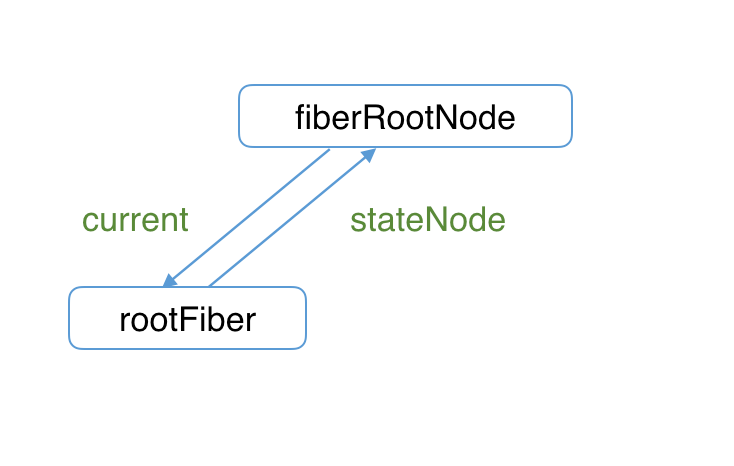

# ReactDOM.render

- 之间的碎片化步骤完整的都痛 reactDOM.render 完成页面渲染的流程

## 创建 fiber

- 从我们知道，首次执行 ReactDOM.render 会创建 fiberRootNode 和 rootFiber。其中 fiberRootNode 是整个应用的根节点，rootFiber 是要渲染组件所在组件树的根节点

- 这一步发生在调用 ReactDOM.render 后进入的 legacyRenderSubtreeIntoContainer 方法中

```
// container指ReactDOM.render的第二个参数（即应用挂载的DOM节点）
root = container._reactRootContainer = legacyCreateRootFromDOMContainer(
  container,
  forceHydrate,
);
fiberRoot = root._internalRoot;
```

- legacyCreateRootFromDomContainer 方法内部会调用 createFiberRoot 方法完成 fiberRootNode 和 rootFiber 的创建以及关联，并初始化 updateQueue

```
export function createFiberRoot(
  containerInfo: any,
  tag: RootTag,
  hydrate: boolean,
  hydrationCallbacks: null | SuspenseHydrationCallbacks,
): FiberRoot {
  // 创建fiberRootNode
  const root: FiberRoot = (new FiberRootNode(containerInfo, tag, hydrate): any);

  // 创建rootFiber
  const uninitializedFiber = createHostRootFiber(tag);

  // 连接rootFiber与fiberRootNode
  root.current = uninitializedFiber;
  uninitializedFiber.stateNode = root;

  // 初始化updateQueue
  initializeUpdateQueue(uninitializedFiber);

  return root;
}
```

- rootFiber 到 fiberRootNode 的引用

- 

## 创建 update

- 在做好了组件的初始化工作，接下来就等待创建 Update 来开启一次更新

- 这一步发生在 updateContainer 方法中

```
export function updateContainer(
  element: ReactNodeList,
  container: OpaqueRoot,
  parentComponent: ?React$Component<any, any>,
  callback: ?Function,
): Lane {
  // ...省略与逻辑不相关代码

  // 创建update
  const update = createUpdate(eventTime, lane, suspenseConfig);

  // update.payload为需要挂载在根节点的组件
  update.payload = {element};

  // callback为ReactDOM.render的第三个参数 —— 回调函数
  callback = callback === undefined ? null : callback;
  if (callback !== null) {
    update.callback = callback;
  }

  // 将生成的update加入updateQueue
  enqueueUpdate(current, update);
  // 调度更新
  scheduleUpdateOnFiber(current, lane, eventTime);

  // ...省略与逻辑不相关代码
}
```

* 值得注意的是其中update.payload = {element}

* 这就是我们在介绍的，对于HostRoot，payload为ReactDOM.render的第一个传参

## 流程概述

* 至此 ReactDOM.render的流程就和我们已知的流程连接上了

* 整个流程如下：
```
创建fiberRootNode、rootFiber、updateQueue（`legacyCreateRootFromDOMContainer`）

    |
    |
    v

创建Update对象（`updateContainer`）

    |
    |
    v

从fiber到root（`markUpdateLaneFromFiberToRoot`）

    |
    |
    v

调度更新（`ensureRootIsScheduled`）

    |
    |
    v

render阶段（`performSyncWorkOnRoot` 或 `performConcurrentWorkOnRoot`）

    |
    |
    v

commit阶段（`commitRoot`）
```

## react的其他入口函数

* 当前React共有三种模式
    - legacy，这是当前React使用的方式，当前没有计划删除本模式，但是这个模式可能不支持一些新功能
    - blocking 开启部分concurrent模式特性的中间模式，目前正在实验中，作为迁移到concurrent模式的第一个步骤
    - concurrent，面向未来的开发模式，我们之前理解的 任务中断/任务优先级都是针对concurrent模式


* legacy模式在合成事件中有自动批处理的功能，但仅限于一个浏览器任务。非react事件想使用这个功能必须使用unstable_batchedUpdates。在blocking模式和concurrent模式下，所有的setState在默认情况下都是批处理的

* 模式的变化应下个了整个应用的工作方式，所以无法只对阵某个组件开启不同模式，基于此原因，可以通过不同的入口函数开启不同模式：
    - legacy ----ReactDOM.render(<App />,rootNode)
      - 仅在事件处理中是批处理
    - blocking ---- ReactDOM.createBlocking(rootNodee).render(<App />)
    - concurrent ---- ReactDOM.createRoot(rootNode).render(<App />)
      - 默认自动批处理