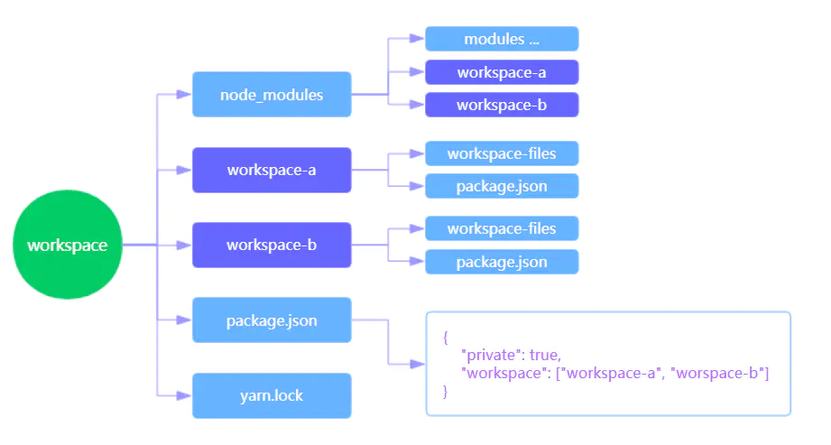

# yarn 与 npm的区别

## workspace的作用

1. 能版主你更好的管理多给子项目repo，这样你可以在每个子项目里使用独立的package.json管理你的依赖，又不用分别进到每个子项目里去yarn install/upfrade 安装/升级依赖，而是使用一条yarn命令去处理所有依赖就像只有一个package.json一样


2. .yarn会根据依赖关系帮助你分析所有子项目的共同依赖，保证所有的项目公用的依赖只会被下载和安装一次

## worksapce的使用

* yarn workspace 并不需要安装什么其他的包，只需要简单的更改paceage.json便可以工作，首先我们需要确定workspace root，一般来说workspace root都会是跟目录

* yarn workspace目录结构树
  

* 根目录的pageage.json
```
{
    // 当private为true是workspace才会被启用
    "private":true,
    "workspace":["workspace-a","workspace-b"]
}
```

* worksapce-a子项目的package.json
```
{
    "name":"workspace-a",
    "version":"1.0.0",
    "dependencies":{
        "cross-env":5.05
    }
}
```


* workspace-b子项目的package.json
```
{
    "name":"workspace-b",
    "version":"1.0.0",
    "dependencies":{
        "cross-env":"5.0.5",
        "workspace-a":"1.0.5"
    }
}
```

* 在根目录执行yarn install
    - 你会发现整个repo只生成了一份yarn.lock，绝大多数的依赖包都被提升到了根目录下的node_modules之内，各个子项目的node_modules里面不会重复存在依赖，只会针对根目录下cross-env的引用。
    - 对于repo内部的依赖关系，yarn也能进行很好的管理

## workspace有那些不足和限制

1. yarn workspace 并没有像lerna那样封装大量的高层api，整个workspace整体上还是依赖于整个yarn命令体系

2. workspace不能嵌套， 只能有一个根workspace

3. workspace采用的是向上遍历，所有workspace并不能识别根workspace之外的依赖

## yarn的优点

1. 速度快，主要来自一下两个方面
    - 并行安装：无论npm还是yarn在执行包的安装时，都会执行一系列任务。npm是按照队列执行每个package，也就是说必须要等到package安装完成后,才能继续后面的安装，而yarn是异步执行所有任务，提高了性能
    - 离线模式：如果之前已经安装过一个软件包，用yarn再次安装时直接从缓存中获取就不同像npm那样再从网络上进行下载

2. 安装版本统一
    - 为了防止拉取到不同的版本，yarn有一个锁定文件 记录了被确切安装上的模块版本号，每次只要新增了一个模块，yarn就会创建(更新)yarn.lock这个文件，这么就保证了 每一次拉取同一个项目时，使用的都是一样的模块版本
    - 当然npm也能实现 但需要输入命令 npm shrinlwrap 而yarn是默认
    - (目前npm也是默认有一个package-lock.json文件)

3. 更简洁的输出
    - npm的输出信息比较冗长，打印了每一个包的信息 yarn默认情况下结合了emoji直观且直接地打印出必要信息

4. 更好的语义化
    - npm install xxx / yarn add xxx